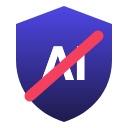

# Slop Shield

Hides AI slop on YouTube. It reads the **"Made with AI"** label that YouTube itself puts on videos, and hides or blurs those videos in search, home and Shorts. It runs entirely in your browser.



## What it hides
| Rule | Default | Why |
|---|---|---|
| Videos YouTube labels "Made with AI" | on | The creator (or YouTube) disclosed it. Precision is high. |
| Channels with 2+ different labelled videos | on | Catches the rest of a slop channel. **Never applies to verified channels.** |
| Shorts titled as made with AI (`#ai`, "AI cat", "made with Sora") | on | Tuned so news and tutorials *about* AI stay visible |
| **Shorts feed: auto-skip** Shorts YouTube labels "Made with AI" | on | The swipe player has no tiles to hide, so it jumps to the next Short (with a "Not AI? Go back" button) |
| Channels you block (🚫 on hover) | on | Your call |
| Strict title keywords | off | Also hits AI news and reviews |

Every hidden video says **why** (in blur mode), and one click on **Not AI** un-hides it for good.

## Honest limits
- Most AI slop is **not labelled**. This is a floor, not a detector. In our tests, AI-heavy searches had 59% of results hidden, and normal searches 1.7% (all creator-disclosed AI).
- There's no pixel-based "AI detector". Research shows they fail on real-world content, and false accusations hurt real creators.
- Etsy support is beta (keyword rules only).

## How the label check can't be spoofed
The label isn't in feed data, so for videos you actually look at (1s on screen) Slop Shield fetches the public watch page. It trusts only YouTube's own structured `howThisWasMadeSectionViewModel` object and its link to the AI-disclosure help article. This works in any UI language and ignores auto-dubbing. Creator-written text (titles, descriptions) can't trigger it; see `tests/test_detect.js`. Page checks are capped at 200/day and stop if YouTube shows a bot check.

## Install (developer mode, until the Chrome Web Store listing is live)
1. Download this repo (Code → Download ZIP) and unzip it.
2. Open `chrome://extensions` and turn on **Developer mode**.
3. Click **Load unpacked** and choose the folder.

## Privacy
There's no server, no analytics, and nothing leaves your browser except requests to youtube.com. See [PRIVACY.md](PRIVACY.md).

## Tests
```
node tests/test_detect.js          # label parser + spoof cases
python test_ui_browser.py          # real browser on live YouTube (needs playwright)
python tests/eval.py               # 16-search false-positive / recall eval
```

## Help wanted
Found AI slop that slipped through, or a real video that got hidden? [Open an issue](https://github.com/saikumargangi/slop-shield/issues) with the link.

Next: a shared, SponsorBlock-style community list (reputation, voting, appeals).

MIT licensed.
